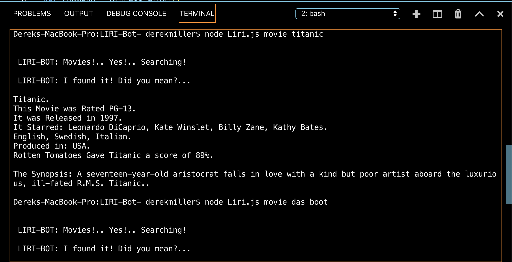
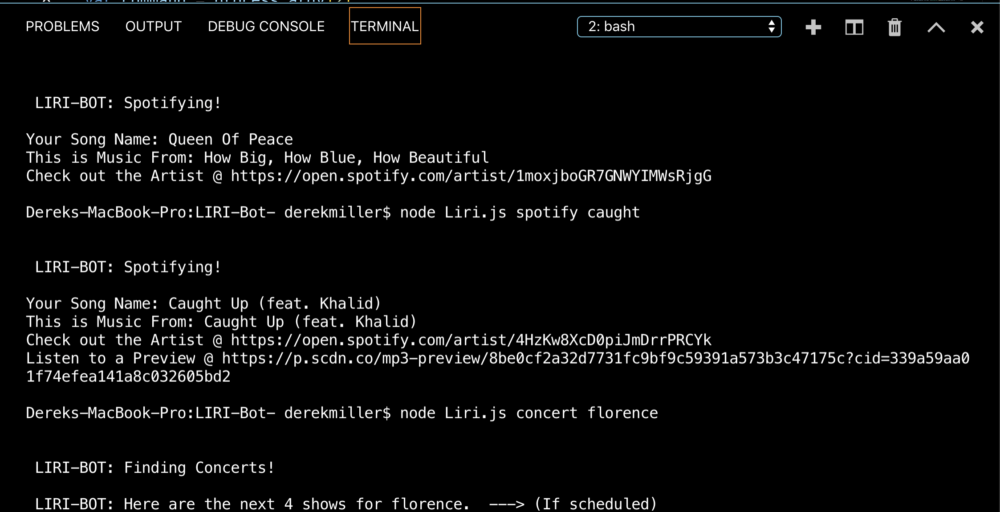
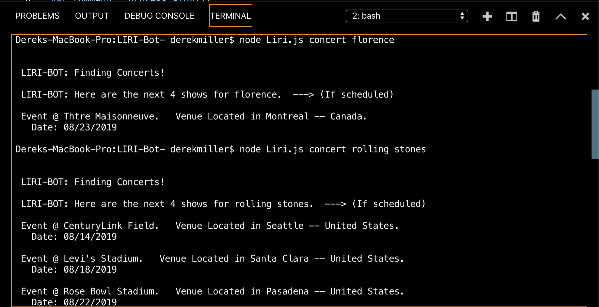
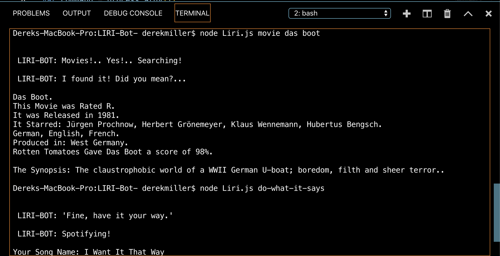

# LIRI-Bot-

### This app is a search platform for music, movies, and concerts.

It is created and based around a Node Command Line model. 
The user can run the app and enter a command followed by their desired search. 

LIRI-BOT will perform the task and return information based on the input. There are 3-4 options for available commands. LIRI can use the API's for Spotify, BandsInTown, and OMDB.

Technologies Used
⋅⋅* Node.js
⋅⋅* Javascript.
⋅⋅* Axios
⋅⋅* Moment
⋅⋅* FS
⋅⋅* API calls

<!-- Technologies including node extensions like Axios, Moment, and FS allow LIRI to make API calls, read/write misc. files, and convert time/date formatting to a user friendly display.   -->

I formatted LIRI's responses to appear in the terminal window, and to be readable and practical. The idea is to display the vital info about the search topic in a clean and organized fashion, making the app memorable and re-usable with ease. 

## Try it for yourself! e.g. " node Liri.js spotify 'song name' "

;

;

;

;

;

